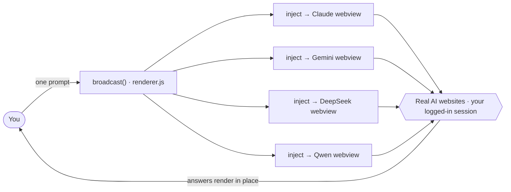

<div align="center">

# 🤖 Multi-AI

### Claude, Gemini, DeepSeek & Qwen — side by side in one window.

Type your prompt **once** and it's sent to **all of them at the same time.**
No API keys, no billing — each panel is a real logged-in browser, so you just sign in normally and watch every model answer in place.

[](https://www.electronjs.org/)
[](#-quick-start)
[](#-project-structure)
[](#why-no-api-keys)
[](LICENSE)

</div>

---

## 👀 Preview

> 📸 _Drop a screenshot into `docs/` and swap it in here. Until then, the layout mock below renders instantly._

```
┌──────────────────────────────── 🤖 Multi-AI ─────────────────────────────────┐
│  [ Log in ]  [ Import logins ]        Grid ⇄ Columns   ☀︎/☾           ＋ Add AI │
├─────────────────────────────────┬─────────────────────────────────────────────┤
│  Claude                    ➤    │  Gemini                                ➤     │
│  ───────────────────────────    │  ─────────────────────────────────────────  │
│  › your prompt …                │  › your prompt …                             │
│  ‹ answer rendering …           │  ‹ answer rendering …                        │
├─────────────────────────────────┼─────────────────────────────────────────────┤
│  DeepSeek                  ➤    │  Qwen                                  ➤     │
│  ───────────────────────────    │  ─────────────────────────────────────────  │
│  › your prompt …                │  › your prompt …                             │
│  ‹ answer rendering …           │  ‹ answer rendering …                        │
├─────────────────────────────────┴─────────────────────────────────────────────┤
│  ✏️  Type a message…                          [ 📎 paste image ]  [ Send to all ]│
└───────────────────────────────────────────────────────────────────────────────┘
```

---

## ✨ Features

- 📢 **Broadcast to every panel** — type once, hit **Send to all** (or Enter). Each panel also has its own **➤** to send to just that one.
- 🧩 **14 built-in AIs + add your own** — Claude, ChatGPT, Gemini, Grok, Perplexity, Copilot, DeepSeek, Qwen, Le Chat (Mistral), Kimi, Meta AI, Poe, Pi, You.com. Enable/disable any, or add a custom site by name + URL. Default enabled: Claude · Gemini · DeepSeek · Qwen.
- 🔐 **Dedicated login window** — a real, full-size browser window that shares the panels' session (with a clean Chrome user-agent so Google sign-in & Cloudflare don't block it). Log in once, everywhere.
- 🍪 **Import logins from Edge/Chrome** — pulls your existing auth cookies straight from your system browser (same idea as `yt-dlp --cookies-from-browser`) so you skip re-logging-in.
- 🖼️ **Paste an image to all panels** — ⌘V an image and it's uploaded into every AI at once (verified before the prompt is sent).
- 🎛️ **Built for focus** — 2×2 grid ⇄ mobile-column view, light/dark theme, drag headers to reorder, double-click to maximize a panel, optional synced scrolling, and ↑/↓ prompt history.

### Why no API keys?

These sites block plain web embedding (Cloudflare bot checks + anti-iframe rules). Multi-AI sidesteps that entirely: **every panel is a genuine Chromium browser view** pointing at the real website. You're using your own logged-in accounts — nothing is proxied, no keys, no per-token cost.

---

## 🛠 How it works



Each site in the catalog (in `renderer.js`) holds its URL, login URL, brand color, and the CSS selectors for its input box and send button. `broadcast()` injects a tiny script into every enabled panel to fill the box and click send.

**Tech:** Electron 33 (Chromium `<webview>` panels) · vanilla JS/HTML/CSS · no framework, no bundler. Auth state persists in an Electron session partition; UI preferences live in `localStorage`.

---

## 🚀 Quick start

> **macOS (Apple Silicon) only.** The app relies on macOS APIs (Keychain + browser cookie DBs) and is packaged for `arm64`.

```bash
git clone https://github.com/hassanannajjar/Multi-Ai.git
cd Multi-Ai

npm install     # downloads Electron (~150 MB, one-time)
npm start       # opens the Multi-AI window
```

**First run:** click **Log in** (or **Import logins**) and sign in to the AIs you want. If a panel shows a Cloudflare check, complete it right inside the panel — it's a real browser. Then type a prompt and **Send to all**.

Build a standalone macOS app bundle:

```bash
npm run package     # → dist/Multi-AI-darwin-arm64/Multi-AI.app
```

No `.env`, no config, no API keys.

---

## 📁 Project structure

```
multi_ai/
├── main.js          # Electron main process — window, login windows, IPC, cookie import, UA spoof
├── preload.js       # contextBridge → exposes a small window.multiai API to the renderer
├── renderer.js      # the app: site catalog, panel rendering, broadcast/inject, image paste, toggles
├── cookie-import.js # macOS: decrypt Edge/Chrome cookies (Keychain + sqlite3) into the app session
├── index.html       # window shell: top bar, panel grid, prompt box, site picker modal
└── styles.css       # light/dark themes, panel & modal layout
```

`renderer.js` is the file to read first — it holds the site catalog and all the app logic.

---

## 🤔 Honest limitations

- **macOS / Apple Silicon only.** Cookie import uses the macOS Keychain + browser SQLite DBs; the build targets `arm64`.
- **Selectors can break.** Injection depends on each site's CSS selectors in `renderer.js`. When a site redesigns its input/send button, that panel stops sending — fix it by updating that site's `input` / `send` selector (Inspect Element on the message box → copy a matching selector → restart).
- **Some logins are device-bound.** Google/Gemini cookies won't import; use the **Log in** window for those.
- **Bot-detection sites.** ChatGPT and Grok may challenge automation — complete any check inside the panel.
- **Per-site image support varies.** Image paste is best-effort; some web chats (e.g. DeepSeek) may not accept images and will just send your text.

---

## 📄 License

[MIT](LICENSE) © 2026 Hassan Al-Najjar

## ⚠️ Disclaimer

A personal productivity tool that automates your own logged-in sessions. Automating these websites may conflict with their Terms of Service — use responsibly, for personal use only.
