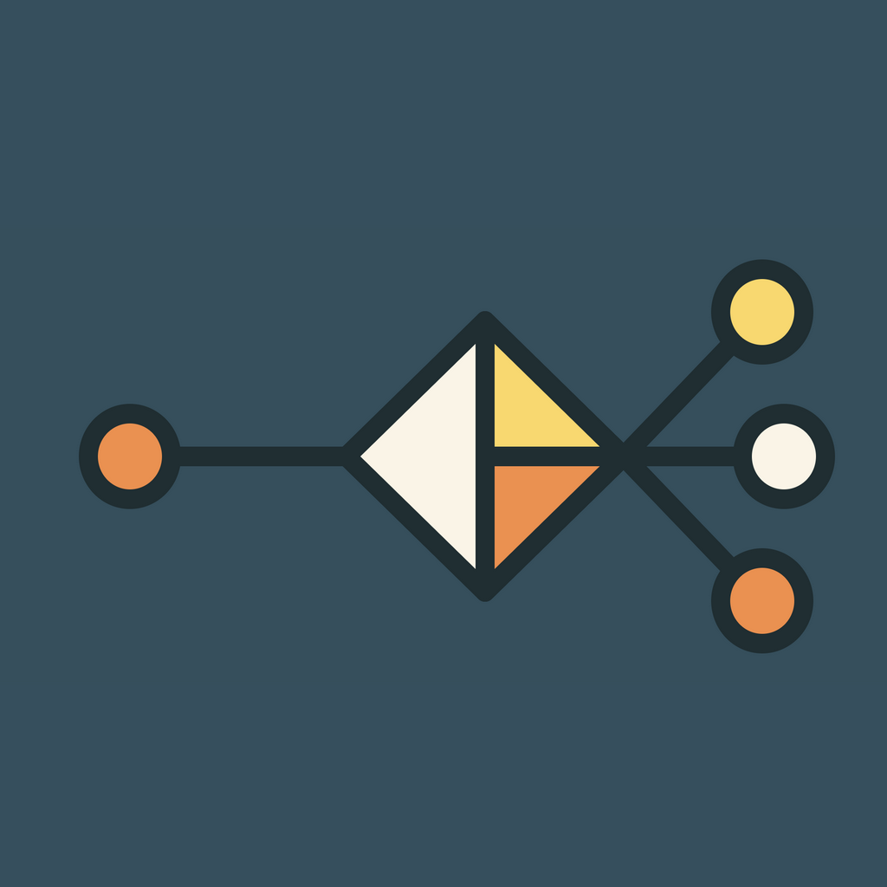
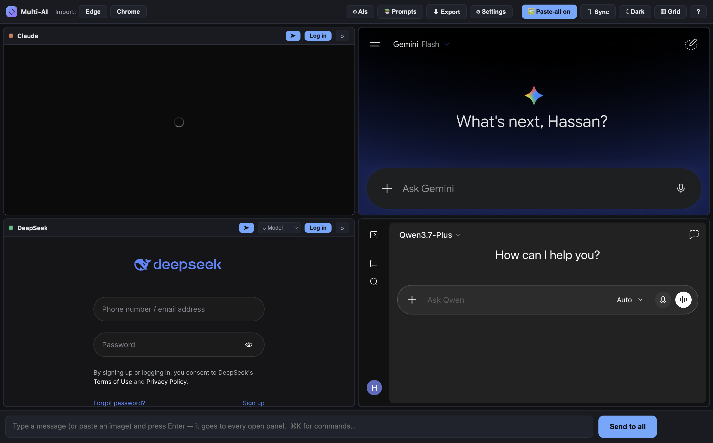
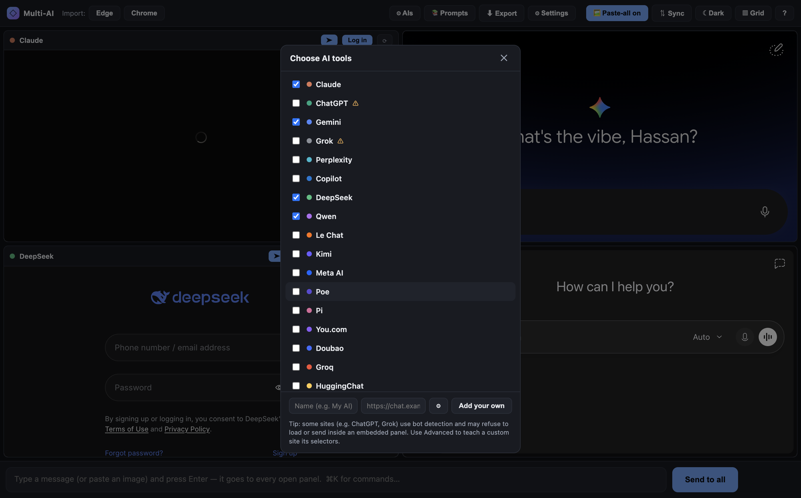
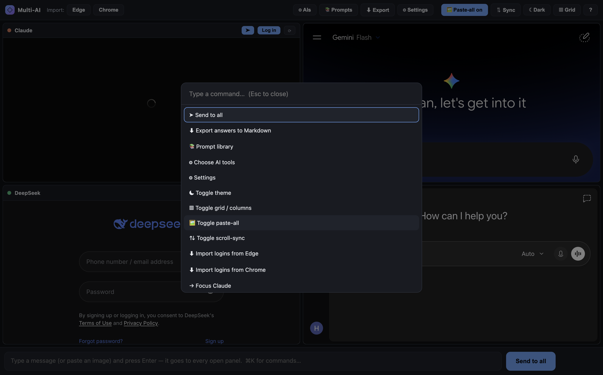
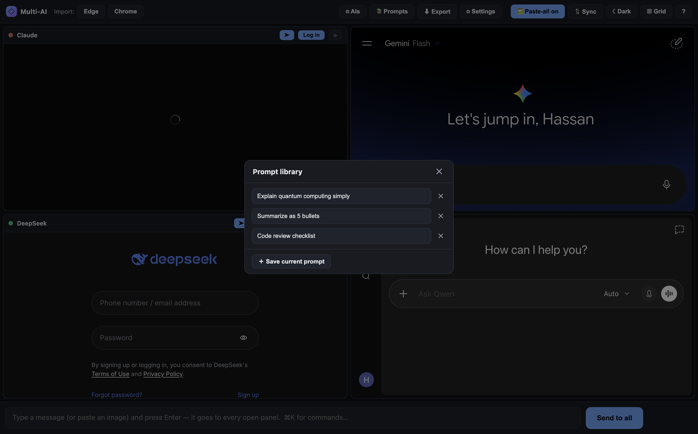
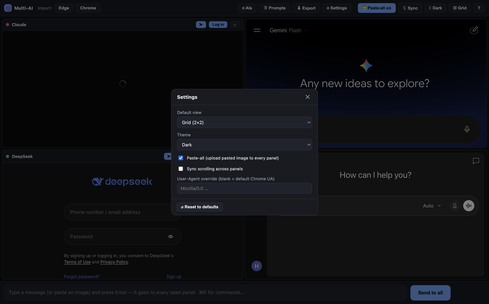
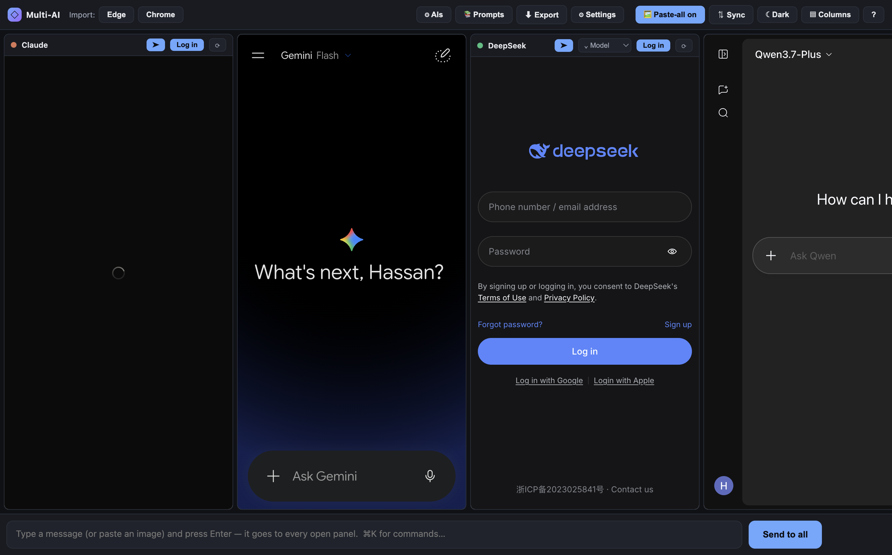
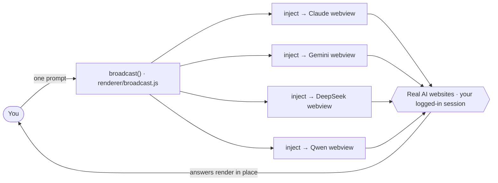

<div align="center">



# Multi-AI

### One prompt in. Every AI out.

Claude · ChatGPT · Gemini · DeepSeek · Qwen · Grok · Perplexity · Copilot **and more — side by side in one window.**
Type your prompt **once** and it goes to **all of them at the same time**. No API keys, no billing — each panel is a real, logged-in browser view.

[](https://www.electronjs.org/)
[](#-quick-start)
[](#-project-structure)
[](CONTRIBUTING.md)
[](LICENSE)

**[🌐 Live page →](https://battastudio.github.io/MulAI/)**

</div>

---

<p align="center"></p>

---

## 🧰 The tools

| | Tool | What it does |
|---|---|---|
| 📢 | **Broadcast** | Type once, hit **Send to all** (or Enter). Every panel also has its own **➤**. |
| 🧩 | **AI picker** | 19 built-in AIs + add your own by URL — with an **Advanced** editor for custom selectors. |
| 📚 | **Prompt library** | Save prompts you reuse and drop them back into the composer in one click. |
| ⬇️ | **Export / compare** | Grab every panel's latest answer into one Markdown file — prompt on top, one section per AI. |
| ⌘ | **Command palette** | `⌘/Ctrl+K` to run any action or jump to a panel, no mouse needed. |
| ⚙️ | **Settings** | Default view, theme, paste-all, scroll-sync, and a User-Agent override — one home. |
| 🍪 | **Import logins** | Pull auth cookies from Edge/Chrome (macOS/Windows/Linux) so you skip re-logging-in. |

## 📸 Screenshots

<table>
  <tr>
    <td align="center"><b>⚙️ AI picker + add your own</b></td>
    <td align="center"><b>⌘ Command palette (⌘/Ctrl+K)</b></td>
  </tr>
  <tr>
    <td></td>
    <td></td>
  </tr>
  <tr>
    <td align="center"><b>📚 Prompt library</b></td>
    <td align="center"><b>⚙️ Settings</b></td>
  </tr>
  <tr>
    <td></td>
    <td></td>
  </tr>
</table>

<p align="center"><br/><i>Mobile-columns view</i></p>

---

## ✨ Highlights

- 📢 **Broadcast to every panel** — one prompt, all models, at once.
- 🧩 **19 built-in AIs + custom sites** — Claude, ChatGPT, Gemini, Grok, Perplexity, Copilot, DeepSeek, Qwen, Le Chat (Mistral), Kimi, Meta AI, Poe, Pi, You.com, Doubao, Groq, HuggingChat, Character.AI, LMArena. Add any site by URL; teach it selectors via **Advanced**.
- 🔐 **Dedicated login window** — a real, full-size browser window sharing the panels' session (clean Chrome UA so Google/Cloudflare don't block sign-in). Log in once, everywhere.
- 🍪 **Import logins from Edge/Chrome** — decrypts your existing cookies (like `yt-dlp --cookies-from-browser`) on **macOS, Windows and Linux**.
- 🖼️ **Paste an image to all panels** — `⌘/Ctrl+V` an image and it uploads into every AI (verified before the prompt sends).
- 🎛️ **Built for focus** — 2×2 grid ⇄ mobile columns, light/dark, drag headers to reorder, double-click to maximize, optional synced scroll, `↑/↓` prompt history, `⌘/Ctrl+K` command palette.

### Why no API keys?

These sites block plain web embedding (Cloudflare bot checks + anti-iframe rules). Multi-AI sidesteps that entirely: **every panel is a genuine Chromium browser view** pointing at the real website. You use your own logged-in accounts — nothing is proxied, no keys, no per-token cost.

---

## 🛠 How it works



Each site in the catalog (`renderer/catalog.js`) holds its URL, login URL, brand color, and optional CSS selectors for the input box and send button. `broadcast()` injects a tiny script into every enabled panel to fill the box and click send.

**Tech:** Electron 33 (Chromium `<webview>` panels) · vanilla JS/HTML/CSS · **no framework, no bundler, zero runtime dependencies.** Auth persists in an Electron session partition; UI preferences in `localStorage`.

---

## 🚀 Quick start

```bash
git clone https://github.com/battastudio/MulAI.git
cd MulAI

npm install     # downloads Electron (~150 MB, one-time)
npm start       # opens the Multi-AI window
```

**First run:** click **Log in** (or **Import**) and sign in to the AIs you want. If a panel shows a Cloudflare check, complete it right inside the panel — it's a real browser. Then type a prompt and **Send to all**.

Build a standalone app bundle:

```bash
npm run package:mac      # → dist/Multi-AI-darwin-*
npm run package:win      # → dist/Multi-AI-win32-x64   (build on/for Windows)
npm run package:linux    # → dist/Multi-AI-linux-x64
```

No `.env`, no config, no API keys. See [`docs/`](docs/) for a page per tool.

---

## 📁 Project structure

```
multi_ai/
├── main.js            # Electron main process — window, login windows, IPC, UA spoof
├── preload.js         # contextBridge → window.multiai (IPC) + shared UA
├── constants.js       # single source of truth for the spoofed User-Agent
├── renderer/          # the app, split into ≤150-line modules on the window.MAI namespace
│   ├── core.js        #   state, store, DOM refs, helpers  (loads first)
│   ├── catalog.js     #   the AI site registry (add a provider here)
│   ├── inject-text.js #   type-and-send payload injected into each panel
│   ├── inject-file.js #   image attach (file input + CDP drop) + preview verify
│   ├── panels.js      #   render panels, drag-reorder, maximize
│   ├── broadcast.js   #   the two-phase send
│   ├── picker.js · prompt-library.js · settings.js · export.js
│   ├── command-palette.js · shortcuts.js · toolbar.js · scroll-sync.js · image.js
│   └── app.js         #   boot + wiring  (loads last)
├── cookies/           # cross-platform cookie import (index dispatches by OS)
│   ├── common.js · macos.js · windows.js · linux.js
├── index.html         # window shell + all modals
├── styles.css         # light/dark themes, panels, modals
├── scripts/check-lines.js   # the ≤150-line CI gate
└── build/icon.*       # app icons (svg/png/icns/ico)
```

New here? Read [`CONTRIBUTING.md`](CONTRIBUTING.md) — it's the short rulebook that keeps this codebase small.

---

## 🤔 Honest limitations

- **Windows/Linux cookie import is code-complete but only lightly tested** — the decrypt math has self-checks, but real-profile import was verified on macOS only. On Windows, `sqlite3` must be on `PATH`.
- **Selectors can break.** Injection depends on each site's CSS selectors. When a site redesigns its input/send button, that panel stops sending — fix it in `renderer/catalog.js` (or, for a custom site, the picker's **Advanced** fields).
- **Some logins are device-bound.** Google/Gemini cookies won't import; use the **Log in** window for those.
- **Bot-detection sites.** ChatGPT and Grok may challenge automation — complete any check inside the panel.
- **Per-site image/answer support varies.** Image paste and answer-export are best-effort heuristics across differing chat DOMs.

---

## 🤝 Contributing

PRs welcome. The rules are deliberately short — see [`CONTRIBUTING.md`](CONTRIBUTING.md). Before opening a PR: `npm run lint` (≤150 lines/file) and `npm test` (cookie self-checks) must pass, and update the README/`docs/` for any user-facing change.

## 📄 License

[MIT](LICENSE) © 2026 Hassan Al-Najjar

## ⚠️ Disclaimer

A personal productivity tool that automates your own logged-in sessions. Automating these websites may conflict with their Terms of Service — use responsibly, for personal use only.
